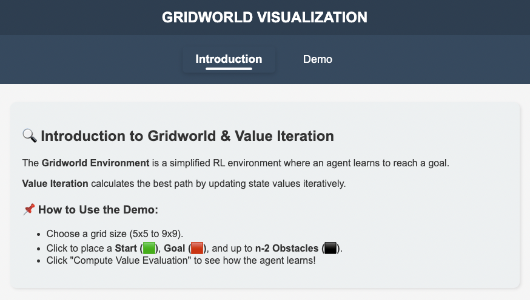
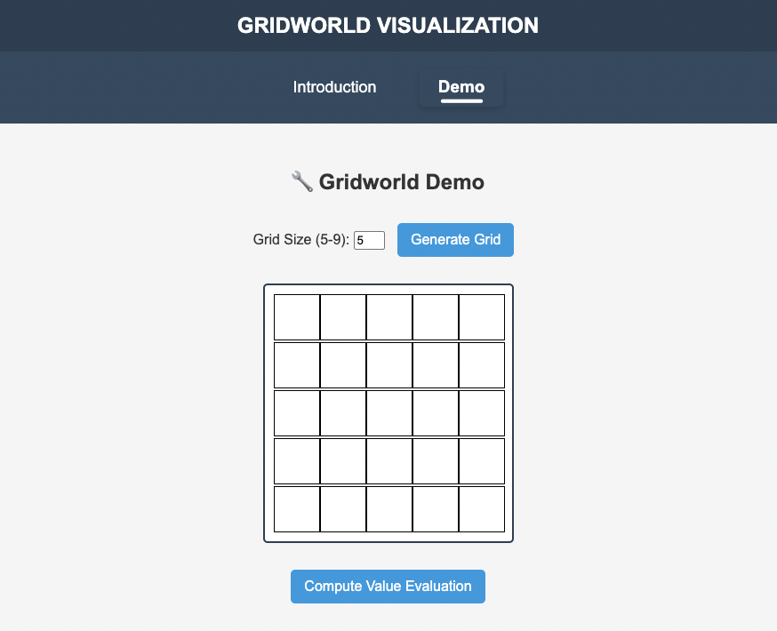
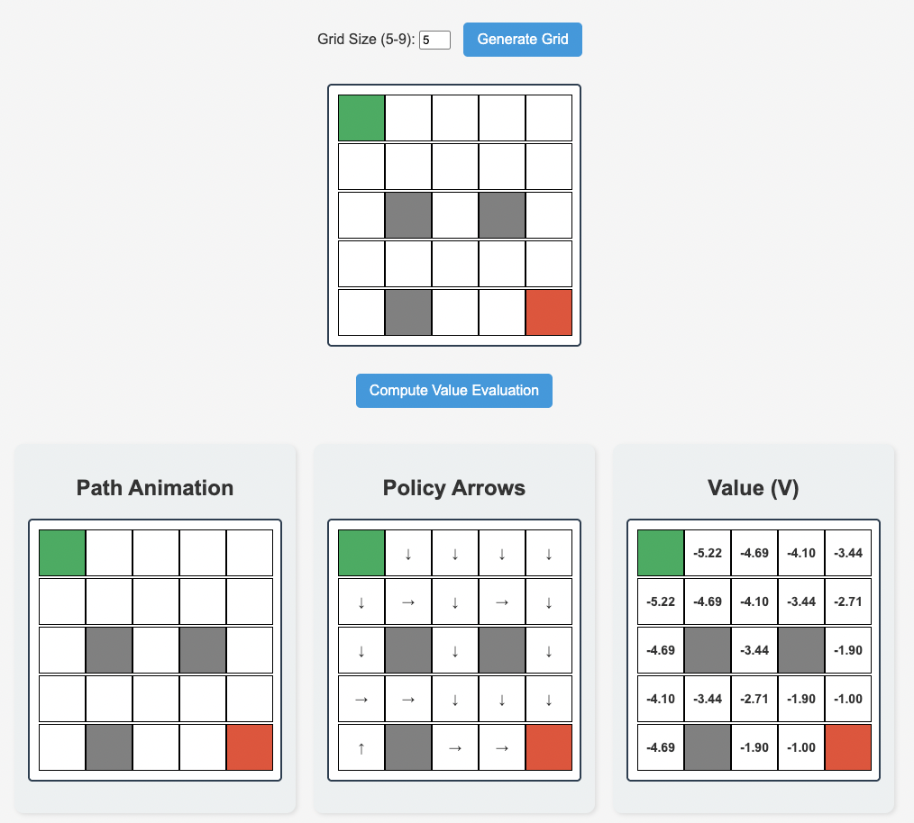

# 🌐 Gridworld Visualization with Value Iteration

An interactive web application to visualize how an agent learns optimal policies in a **Gridworld environment** using **Value Iteration**. This project simulates the learning process step by step and presents:

-   🟨 **Animated agent path** per iteration
-   🧭 **Policy arrows** (← ↑ ↓ →)
-   📈 **Value function** V(s)

## 📸 Demo Preview

<div align="center">
  
  
  
</div>

## 🧠 How It Works

-   You create a grid (5x5 to 9x9)
-   Define:
    -   🟩 Start position
    -   🟥 Goal position
    -   ⬛ Obstacles (n - 2 max)
-   Click **"Compute Value Evaluation"**
-   The system uses **Value Iteration** to:
    -   Evaluate V(s)
    -   Extract optimal policy π(s)
    -   Animate the agent's exploration over iterations
    -   Show final deterministic optimal path

---

## 🧰 Tech Stack

| Layer       | Technologies                             |
| ----------- | ---------------------------------------- |
| 🌐 Frontend | `HTML`, `CSS`, `JavaScript`              |
| 🔥 Backend  | `Python`, `Flask`                        |
| 🧪 Logic    | `NumPy`, Value Iteration, Custom Trace   |
| 🎨 UI/UX    | Responsive Layout + Animated Exploration |

---

## 🚀 Getting Started

### 1️⃣ Clone the repository

```bash
git clone git@github.com:Sunny091/Gridworld-Environment-and-Value-Iteration.git
cd gridworld-visualizer
```

### 2️⃣ Install dependencies

```bash
pip install flask numpy
```

### 3️⃣ Run the Flask app

```bash
python app.py
```

Then open your browser at [http://127.0.0.1:5000](http://127.0.0.1:5000)

---

## 📁 Project Structure

```
📦 project/
├── app.py              # Flask backend + Value Iteration logic
├── templates/
│   └── index.html      # Main interactive UI
├── static/
│   └── styles.css      # Styling and responsive layout
└── README.md
```

---

## 📌 Features

✅ Click-to-create Grid  
✅ Start / Goal / Obstacle placement  
✅ Animated path with agent trial-and-error  
✅ Policy Arrows visualization  
✅ State Value Table (V)  
✅ Responsive layout (mobile + desktop)

---

## ✨ Author

Made with ❤️ by [CHIH-HSUAN, SHEN]  
Feel free to fork, contribute, and explore reinforcement learning!
